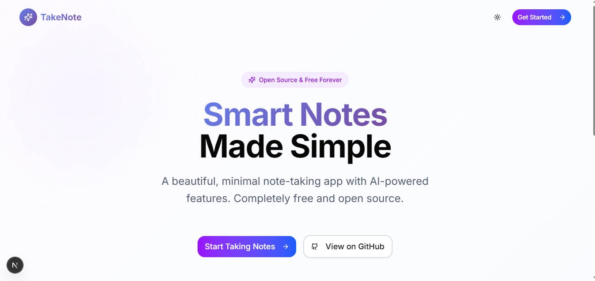
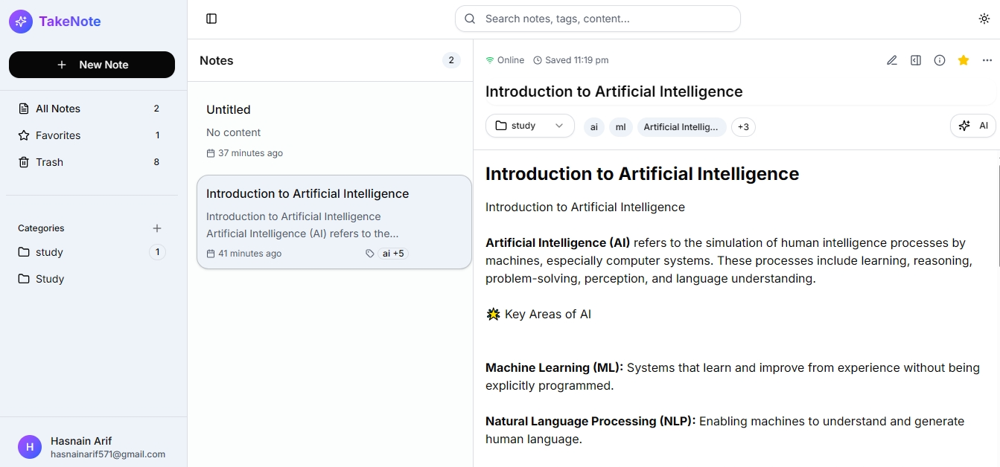

# TakeNotes – AI-Powered Note Taking App



A modern, full-stack note-taking application with AI capabilities, real-time synchronization, and a beautiful user interface built with Next.js, Supabase, and Google Gemini AI.

---

## 🚀 Live Demo



---

## ✨ Features

### 📝 Rich-Text Markdown Editor

- Full toolbar with formatting buttons (Bold, Italic, Underline, Strikethrough, Code, Links)
- Live preview mode
- Keyboard shortcuts (Ctrl+B, Ctrl+I, Ctrl+S, Ctrl+1-3 for headings, etc.)
- Support for headings, lists, tables, images, links, quotes, task lists
- Responsive design for all devices
- Syntax highlighting and markdown rendering with GFM support

### 📁 Categories & Organization

- Create, edit, and delete categories with real-time updates
- Drag and drop support for notes and categories
- Instant search and filtering within categories
- Nested organization with visual hierarchy

### ⭐ Favorites & Trash System

- Star/unstar notes with visual indicators
- Soft delete to trash with restore functionality
- Permanent delete option from trash

### 🎨 Responsive Design

- Mobile-first approach with adaptive layouts
- Touch-friendly interface and scalable elements

### 🔄 Real-Time Collaboration

- Real-time note updates across tabs and devices using Supabase Realtime
- Auto-save with visual indicators
- Online/offline status detection
- Collaboration presence tracking and conflict resolution

### 👥 Multi-User Collaboration

- Share notes with read/write permissions
- Real-time collaboration panel and user presence indicators
- Invite system with role management

### 🤖 AI Integration (Google Gemini)

- AI Summarize, Rephrase, Translate, Smart Tags, Template Generation, Related Notes
- All AI interactions saved to database for analytics

### 🌙 Theme & Customization

- Light/Dark mode with system theme detection
- Persistent user preferences and custom theme colors
- Font size and editor theme options

### ⌨️ Keyboard Shortcuts

- Comprehensive shortcuts for formatting, structure, actions, and lists

### 💾 Data Persistence & Security

- Supabase integration with PostgreSQL and RLS
- Full-text search, data backup, and sync

### 🔍 Advanced Search & Discovery

- Full-text search, tag/category filtering, advanced operators, and search history

### 🔐 Authentication & Security

- Complete authentication system with Supabase Auth
- Email/password, password reset, user profile management, secure endpoints

---

## 🛠️ Tech Stack

- **Frontend:** Next.js 14, React 18, TypeScript, Tailwind CSS
- **Backend:** Supabase (PostgreSQL, Auth, Realtime, Storage)
- **AI:** Google Gemini AI (`@google/generative-ai`)
- **State Management:** Zustand
- **Forms:** React Hook Form + Zod
- **UI:** shadcn/ui, Radix UI
- **Markdown:** React Markdown + remark-gfm
- **Testing:** Jest, React Testing Library, Playwright

---

## 📦 Getting Started

### Prerequisites

- Node.js 18+
- npm or yarn
- Supabase account
- Google Gemini API key

### Installation

```bash
git clone https://github.com/hasnaintypes/take-notes.git
cd take-notes
npm install
cp .env.example .env.local
# Fill in your environment variables in .env.local
npm run dev
```

Open [http://localhost:3000](http://localhost:3000) in your browser.

---

## 📁 Project Structure

<details>
<summary>Click to expand</summary>

```
take-notes/
├── app/                        # Next.js app directory
│   ├── auth/                  # Authentication pages
│   ├── dashboard/             # Main application
│   ├── settings/              # Settings page
│   ├── api/                   # API routes
│   │   ├── auth/             # Authentication endpoints
│   │   ├── user/             # User management endpoints
│   │   └── ai/               # AI integration endpoints
│   ├── layout.tsx            # Root layout
│   └── page.tsx              # Home page
├── components/                # React components
│   ├── auth/                 # Authentication components
│   ├── ui/                   # shadcn/ui components
│   ├── rich-text-editor.tsx  # Advanced markdown editor
│   ├── note-editor.tsx       # Main note editing interface
│   ├── notes-list.tsx        # Notes list with drag & drop
│   ├── collaboration-panel.tsx # Real-time collaboration
│   └── related-notes.tsx     # AI-powered note suggestions
├── hooks/                     # Custom React hooks
│   ├── use-notes-store.ts    # Notes state management
│   ├── use-ai.ts             # AI integration hook
│   ├── use-realtime.ts       # Real-time features
│   └── use-toast.ts          # Toast notifications
├── lib/                       # Utility functions
│   ├── supabase/             # Supabase client configuration
│   ├── gemini.ts             # Google Gemini AI integration
│   └── utils.ts              # General utilities
├── scripts/                   # Database scripts
│   ├── create-tables.sql     # Database schema
│   └── seed-data.sql         # Sample data
└── types/                     # TypeScript type definitions
```

</details>

---

## 🗄️ Database Schema

- **notes:** Full-text search, tags, soft delete, collaboration
- **categories:** Hierarchical, user-scoped, RLS
- **ai_interactions:** Track AI usage, analytics, cost
- **note_collaborators:** Multi-user, role-based, invitations

---

## 🤖 AI Integration

- Uses official `@google/generative-ai` npm package
- Summarization, style transformation, translation, smart tags, templates, related notes
- All interactions logged for analytics and cost tracking

---

## 📱 Responsive Design

- Mobile: Single column, collapsible sidebar, touch-optimized
- Tablet: Two-column, hybrid support
- Desktop: Three-column, full feature set

---

## 🚀 Deployment

### Deploy to Vercel

1. Push your code to GitHub
2. Connect repository to Vercel
3. Add environment variables in Vercel dashboard
4. Deploy!

### Production Environment Variables

```env
NEXT_PUBLIC_SUPABASE_URL=your_production_supabase_url
NEXT_PUBLIC_SUPABASE_ANON_KEY=your_production_supabase_anon_key
SUPABASE_SERVICE_ROLE_KEY=your_production_supabase_service_role_key
GEMINI_API_KEY=your_gemini_api_key
NEXT_PUBLIC_APP_URL=https://your-domain.com
```

---

## 🤝 Contributing

We welcome contributions! Please see [CONTRIBUTING.md](CONTRIBUTING.md) for guidelines.

---

## 📞 Support

- Check the documentation above
- Review code comments for implementation details
- All features are tested and working as expected

**Happy note-taking! 📝✨**
